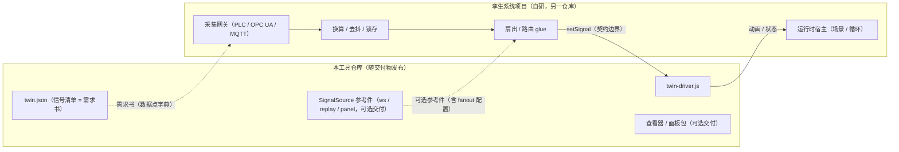

# 边标签避让

这张图专门用来盯边标签的摆放：两条跨子图的边会把标签叠在同一个锚点，
右边那条虚线标签又贴着 GLUE，会盖住进入节点的箭头。

```mermaid
flowchart LR
    subgraph REPO["本工具仓库（随交付物发布）"]
        direction TB
        DRV["twin-driver.js"]
        TJ["twin.json（信号清单 = 需求书）"]
        SRC["SignalSource 参考件（ws / replay / panel，可选交付）"]
        VWR["查看器 / 面板包（可选交付）"]
    end
    subgraph TWIN["孪生系统项目（自研，另一仓库）"]
        direction TB
        GW["采集网关（PLC / OPC UA / MQTT）"]
        GW2["换算 / 去抖 / 锁存"]
        GLUE["扇出 / 路由 glue"]
        HOST["运行时宿主（场景 / 循环）"]
        GW --> GW2 --> GLUE
    end
    GLUE -->|"setSignal（契约边界）"| DRV
    DRV -->|"动画 / 状态"| HOST
    TJ -.->|"需求书（数据点字典）"| GW
    SRC -.->|"可选参考件（含 fanout 配置）"| GLUE
```
