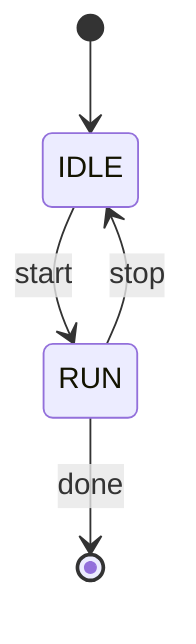

# 基本围栏

下面这段是状态图，页面里会画成图（Node 侧渲染时是普通代码块，两条路都要正常）。


```mermaid
stateDiagram-v2
    [*] --> IDLE
    IDLE --> RUN : start
    RUN --> IDLE : stop
    RUN --> [*] : done
```

中间夹一段别的代码围栏，不能受影响：

```js
var a = 1;
console.log(a);
```

行内代码 `` `mermaid` `` 也不能被当成围栏。
